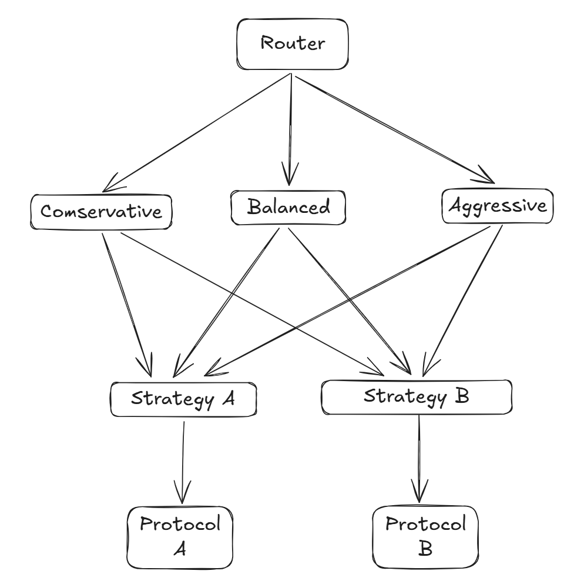

# Growish - Stablecoin Yield Aggregator

Growish adalah platform yield aggregator yang fokus pada stablecoin (USDC) dengan tujuan menyelesaikan masalah gas fees yang tinggi, kompleksitas bagi pemula, dan kurangnya transparansi di DeFi.

## Fitur Utama

1.  **Pooled Vault System**: User dengan risk level yang sama menaruh dana dalam 1 vault bersama.
2.  **Batching**: Menghemat gas fee dengan memproses deposit dan withdrawal secara massal.
3.  **3 Risk Levels**:
    *   **Conservative**: Menggunakan strategi alokasi dinamis berbasis APY (Alokasi Awal: 50% Protocol A + 50% Protocol B).
    *   **Balanced**: Menggunakan strategi alokasi dinamis berbasis APY (Alokasi Awal: 50% Protocol A + 50% Protocol B).
    *   **Aggressive**: Menggunakan strategi alokasi dinamis berbasis APY (Alokasi Awal: 50% Protocol A + 50% Protocol B).

    *Catatan: Saat ini logika alokasi di semua vault identik (Equal Split di awal, lalu APY-Weighted Rebalancing).*

## Smart Contracts

Berikut adalah daftar smart contract utama dalam proyek ini beserta perannya:

### 1. Router.sol
**Peran**: Entry point utama untuk interaksi user.
*   Mengelola antrian (queue) untuk deposit dan withdrawal.
*   Melakukan batching transaksi untuk efisiensi gas.
*   Mengarahkan dana ke Vault yang sesuai berdasarkan pilihan Risk Level user.
*   **Interaksi**: Berinteraksi dengan `MockUSDC` (transfer dana user) dan `Vault` (deposit/redeem batch).

### 2. Vault.sol
**Peran**: Pool dana user dan pengelola strategi.
*   Menerbitkan shares (ERC-20) sebagai bukti kepemilikan user.
*   Mengelola alokasi dana ke berbagai Strategy.
*   Melakukan auto-compounding yield.
*   Melakukan rebalancing antar strategi berdasarkan performa (APY).
*   **Interaksi**: Berinteraksi dengan `Strategy` (deploy/withdraw dana) dan `Router` (menerima batch deposit/withdraw).

### 3. Strategy.sol
**Peran**: Jembatan teknis ke protokol DeFi eksternal.
*   Menyimpan logika spesifik untuk berinteraksi dengan protokol tertentu (misal: Aave, Compound).
*   Memegang receipt token dari protokol.
*   Melakukan harvest yield.
*   **Interaksi**: Berinteraksi dengan `MockProtocol` (supply/withdraw/claim) dan `Vault`.

### 4. MockProtocol.sol
**Peran**: Simulasi protokol DeFi lending (seperti Aave/Compound).
*   Menerima deposit USDC dan memberikan yield (bunga).
*   Digunakan untuk testing dan simulasi pertumbuhan dana.
*   **Interaksi**: Berinteraksi dengan `Strategy`.

### 5. MockUSDC.sol
**Peran**: Token stablecoin ERC-20 untuk keperluan testing.
*   Merepresentasikan USDC di environment testnet/local.

## Panduan Interaksi User

Untuk menggunakan yield aggregator ini, user hanya perlu berinteraksi dengan contract berikut:

1.  **MockUSDC**:
    *   `approve(routerAddress, amount)`: Memberikan izin kepada Router untuk memindahkan USDC user sebelum deposit.

2.  **Router**:
    *   `deposit(amount, riskLevel)`: Menyetorkan USDC ke dalam antrian batching.
    *   `withdraw(shares, riskLevel)`: Meminta penarikan dana dari vault (membutuhkan approval shares ke Router terlebih dahulu).
    *   `claimDepositShares(riskLevel)`: Mengklaim vault shares setelah batch deposit dieksekusi.
    *   `claimWithdrawAssets(riskLevel)`: Mengklaim USDC setelah batch withdraw dieksekusi.

User **TIDAK** perlu berinteraksi langsung dengan Vault, Strategy, atau Protocol. Semua kompleksitas tersebut ditangani oleh Router dan Vault secara otomatis.

## Deployed Contracts (Lisk Sepolia Testnet)

Berikut adalah alamat kontrak yang telah dideploy dan diverifikasi di jaringan Lisk Sepolia Testnet:

*   **MockUSDC**: `0x6f576F9A89555b028ce97581DA6d10e35d433F04`
*   **Router**: `0x7dC0da00F845A4272C08E51a57651ac004f5e0C7`
*   **Vault Conservative**: `0x6E69Ed7A9b7F4b1De965328738b3d7Bb757Ea94c`
*   **Vault Balanced**: `0x21AF332B10481972B903cBd6C3f1ec51546552e7`
*   **Vault Aggressive**: `0xc4E50772bd6d27661EE12d81e62Daa4882F4E6f4`
*   **MockProtocol Aave**: `0x53175d08E96a961233ea333385EA74E74C556Cf1`
*   **MockProtocol Compound**: `0x831f464C241eAa6CcF72F5570c7F5E5f9759317e`
*   **Strategy Aave**: `0x85A1B6A61C5E73418A40A3a79F6E811Ee848dAa7`
*   **Strategy Compound**: `0x4B29149492019fE65D0363097728Cab61Cb97F0f`
